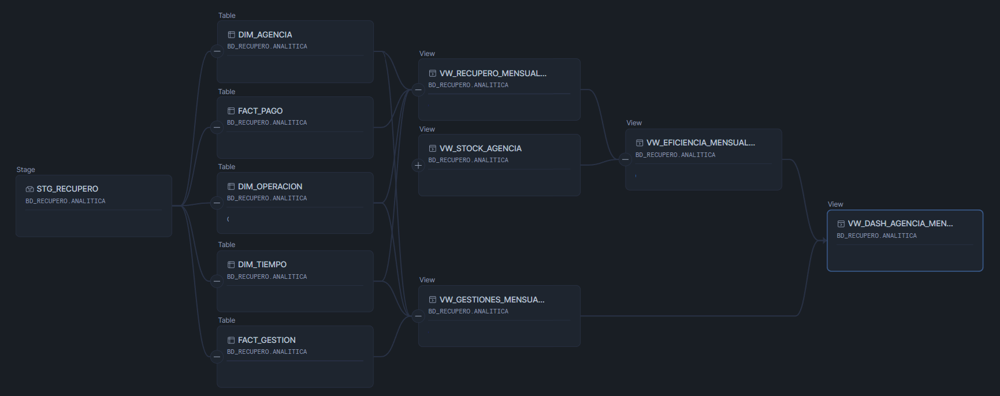
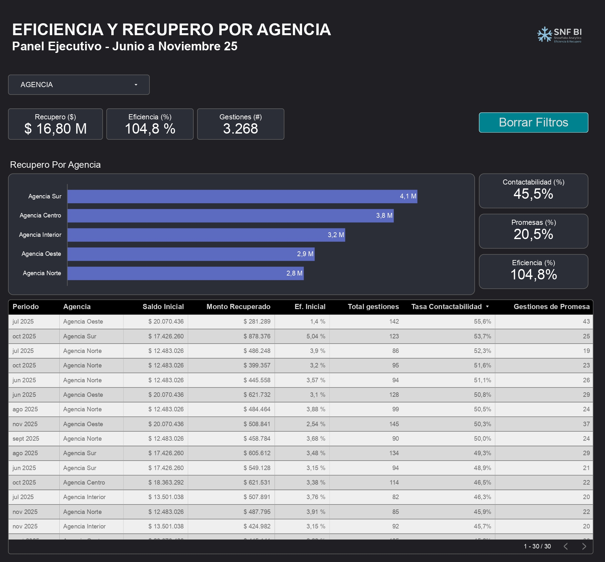
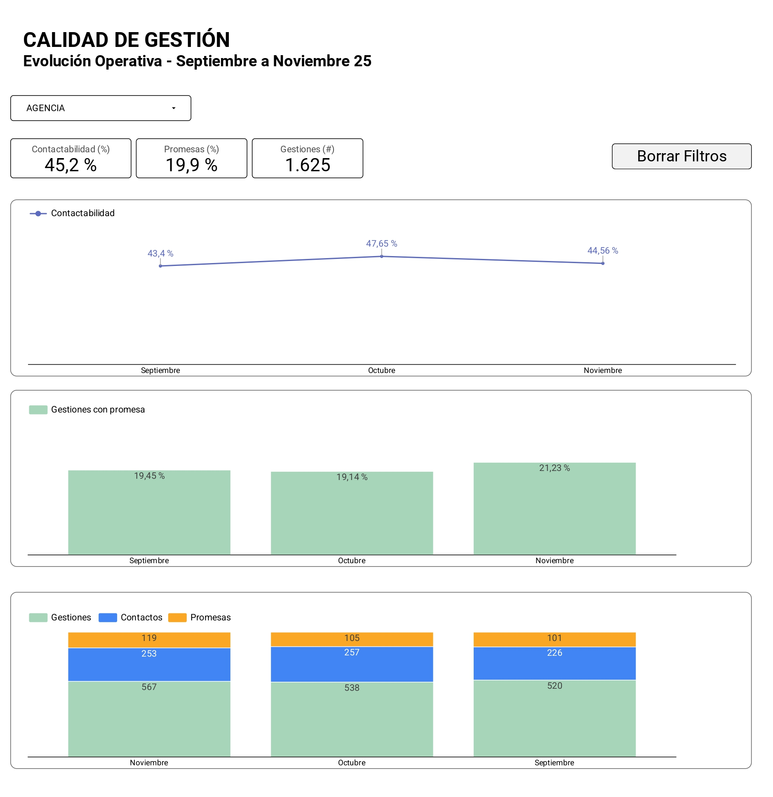

Un proyecto end-to-end que integra Snowflake y Looker Studio para analizar la performance de agencias de cobranza. Incluye ingesta desde CSV, modelo estrella, vistas analíticas y dashboards ejecutivos con métricas de recupero, eficiencia, contactabilidad y calidad operativa.

# Snowflake recupero-analytics-snowflake 

Este proyecto integra **Snowflake** y **Looker Studio** para analizar la performance de distintas agencias de cobranza.

Incluye:

- Carga de datos desde CSV a un Stage interno
- Modelo en **esquema estrella** (dimensiones + hechos)
- Vistas analíticas mensuales para BI
- Dashboards ejecutivos con métricas clave:
  - Recupero por agencia
  - Eficiencia sobre stock
  - Contactabilidad
  - Promesas
  - Volumen total de gestiones

## Tecnologías
- Snowflake  
- SQL  
- Looker Studio  
- CSV (dataset sintético)

##  Contenido del repositorio
- `/sql` Scripts de creación de tablas y vistas  
- `/images` Capturas de los dashboards  
- `/docs` Documentación del proyecto  

##  Dashboards creados
**Página 1 – Panel Ejecutivo**
- Recupero total  
- Eficiencia (%)  
- Gestiones (#)  
- Recupero por agencia

**Página 2 – Calidad Operativa**
- Contactabilidad por mes  
- Promesas por mes  
- Gestiones vs Contactos vs Promesas  
- Tabla operativa mensual

##  Resumen del proyecto
Este trabajo replica una prueba técnica típica para roles de  
**Data Engineer / Analytics Engineer / BI Developer**, donde se evalúa:

- carga y transformación de datos en Snowflake,  
- modelado dimensional,  
- creación de vistas analíticas,  
- y construcción de dashboards claros y ejecutivos.

##  Capturas

### Diagrama lógico

### Capturas del dashboard

### Página 1

### Página 2

### PARchivos .csv
[dim_agencia](csv/dim_agencia.csv)

[dim_operacion](csv/dim_operacion.csv)

[dim_tiempo](csv/dim_tiempo.csv)

[fact_gestion](csv/fact_gestion.csv)

[fact_pago](csv/fact_pago.csv)

##  Autor

[Nicolás Giovannoni](https://www.linkedin.com/in/nicolas-giovannoni2806/)

